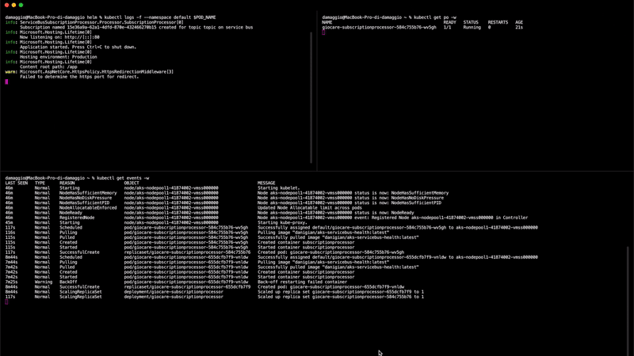

# Kubernetes and Health Probes for Service Bus based application

This repository includes a sample .Net Core application and Helm template with probes for checking the liveness of the underneath Service Bus Subscription connection.

## Contents

* [Repository structure](#repository-structure)
* [Getting started](#getting-started)
* [Helm configuration](#helm-configuration)
* [Health check options](#health-check-options)

## Repository structure

The repository contains the following folders:

- **.github**: containing the GitHub Actions definition for building and pushing the Docker image of the sample application
- **deploy**: containing the Helm template for deploying the application on your Kubernetes Cluster
- **src**: containing the source

## Getting started

This repository contains a helm chart to deploy the processor to a Kubernetes cluster.

### Prerequisites:

- [Azure Service Bus Namespace](https://docs.microsoft.com/en-us/azure/service-bus-messaging/service-bus-create-namespace-portal)
- [Azure Service Bus Topic](https://docs.microsoft.com/en-us/azure/service-bus-messaging/service-bus-quickstart-topics-subscriptions-portal#create-a-topic-using-the-azure-portal)
- [Azure Kubernetes Service](https://docs.microsoft.com/en-us/azure/aks/kubernetes-walkthrough-portal)

### Deploying the helm chart

In order to run the sample application, you need to authenticate and authorize requests to Azure Service Bus.

#### Using a connection string

1) Retrieve the [connection string](https://docs.microsoft.com/en-us/azure/service-bus-messaging/service-bus-create-namespace-portal#get-the-connection-string)

1) Navigate to the deploy/helm folder

1) Properly format and run the following command:

```bash
helm install release-name SubscriptionProcessorChart --set ServiceBusConfiguration.ConnectionString="ConnectionStringYouRetrievedBefore" --set ServiceBusConfiguration.EntityPath="TopicName"
```

#### Using Managed Identity

1) Follow instructions in the [AAD Pod Identity repo](https://github.com/Azure/aad-pod-identity) in order to deploy the required prerequisites
1) Assign your Managed Identity the **"Contributor"** role scoped to Azure Service Bus Namespace
1) Assign your Managed Identity the **"Azure Service Bus Data Receiver"** role to Azure Service Bus Topic
1) Navigate to the deploy/helm folder
1) Properly format and run the following command:

```bash
helm install release-name SubscriptionProcessorChart --set ServiceBusConfiguration.Namespace="Namespace" --set ServiceBusConfiguration.EntityPath="TopicName" --set PodIdentity.Enabled=true --set PodIdentity.BindingLabel="The Label You Specified In Step1"
```

### Making it fail

After the solution is successfully deployed and running, disable the Service Bus subscription that the application created on the fly.

If you take a look at the logs (*kubectl logs -f pod-name*) and at the events (*kubectl get events*) you will realize that:

1) Multiple exceptions will be quickly thrown
1) Liveness probe is executed by Kubernetes every 10 seconds
1) After 3 consecutive "Unhealthy" status, the pod gets killed
1) The pod restarts and creates a new Subscription. Everything is working normally again.



## Helm configuration
The following table lists the configurable parameters of the chart and their default values.

| Parameter | Description | Required | Default |
|---|---|---|---|
| `image.repository` | The image repository to pull from | | danigian/aks-servicebus-health |
| `image.pullPolicy` | The image pull policy | | Always |
| `imagePullSecrets` | The image secrets for pulling | | [] |
| `resources.requests.cpu` | CPU resource requests | | 300m |
| `resources.limits.cpu`| CPU resource limits | | 300m |
| `resources.requests.memory` | Memory resource requests | | 256Mi |
| `resources.limits.memory`| Memory resource limits | | 256Mi |
| `PodIdentity.Enabled` | Boolean for enabling AAD PodIdentity Binding | | false |
| `PodIdentity.BindingLabel` | Label for AAD PodIdentity Binding | if `PodIdentity.Enabled` is true | "" |
| `ServiceBusConfiguration.SbMinimumAllowedBackoffTime` | Minimum backoff time for the Exponential Retry Policy (in seconds) | | 0 |
| `ServiceBusConfiguration.SbMaximumAllowedBackoffTime` | Maximum backoff time for the Exponential Retry Policy (in seconds) | | 30 |
| `ServiceBusConfiguration.SbMaximumAllowedRetries` | Maximum number of retries for the Exponential Retry Policy | | 5 |
| `ServiceBusConfiguration.SbMonitorGracePeriod` | Grace period for the internal application liveness health check (in seconds) | | 120 |
| `ServiceBusConfiguration.ConnectionString` | Connection string to Azure Service Bus Namespace | required if `PodIdentity.Enabled` is false | "" |
| `ServiceBusConfiguration.EntityPath` | ServiceBus Topic Name | always required | "" |
| `ServiceBusConfiguration.Namespace` | ServiceBus Namespace | required if `PodIdentity.Enabled` is true | "" |

## Health check options

The source code you find in this repository is evaluating healthiness of the system based on the [exceptions raised by the SubscriptionClient](https://docs.microsoft.com/en-us/azure/service-bus-messaging/service-bus-messaging-exceptions).

These exceptions can be transient, therefore retryable, or not.

For the C# SDK, the default RetryExponential policy, inherits from the abstract class RetryPolicy. 

If a exception is transient, it will be [retried following the defined policy](https://github.com/Azure/azure-sdk-for-net/blob/7f194f90110a04595714cd14e458301b02836477/sdk/servicebus/Microsoft.Azure.ServiceBus/src/RetryPolicy.cs#L116-L125), otherwise it will be immediately thrown.

In this application implementation, whenever an exception gets raised, it will be reported to the SubscriptionMonitor.

If multiple non transient exceptions get thrown, there must be something definitely wrong and Kubernetes should kill the pod as soon as possible.

If transient exceptions get thrown, we should try to understand if the application recovered in the grace period or not. Therefore, at its startup, the SubscriptionMonitor calculates how many exceptions will be thrown, as a maximum, given the number of possible retries in the defined grace period.

### Alternative options 

Even if the suggested approach is working, other alternatives should be considered.

If sending an heartbeat message to the topic will not affect other applications listening to that topic, your application health check should be based on the actual receipt of that heartbeat message.

This would ensure the liveness of the underneath connection *and* the proper acceptance of the message.